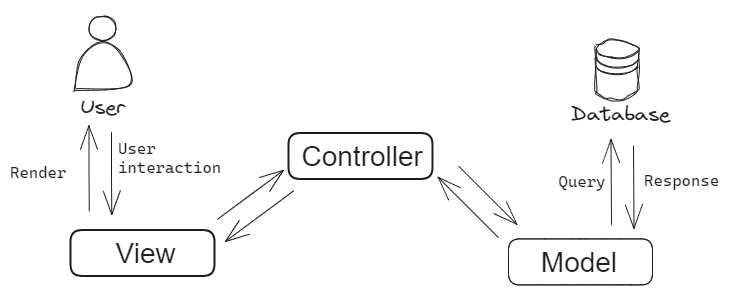

# Modern Application Development 1

A list of resources:
- Link to all screencasts in the course: [click here](https://thejeshgn.com/projects/modern-application-development-1/)
- [Internetting is Hard](https://internetingishard.netlify.app/)
- [High performance Browser Networking](https://hpbn.co/)
- [MDN docs](https://developer.mozilla.org/en-US/)
- [Scrimba courses](https://v2.scrimba.com/courses)

# Contents
| Content | Topics |
|----|------|
| [Week-1](#week-1) | Architecture, Protocols, HTTP requests, Web performance <br> <ol> <li>[Tutorial 1.1 : Replit for MAD1](https://youtu.be/tWA2FT4i4cY)</li> <li>Screencast 1.1  Serve HTML files on LAN </li></ol> |
| [Week-2](#week-2) | Encoding, HTML, CSS |  
| [Week-3](#week-3) |  Design principles |
| [Week-4](#week-4) |  Data Storage & Management |
| [Week-5](#week-5) |  MVC, CRUD, Controllers, Routes |
| [Week-6](#week-6) |  API and REST |


# Week 1
An app has three major components:
- Storage : Store temporary and permanent data as files
- Computation : Performs functions required to by the user
- Presentation : Display the output to user

There are many platforms to make apps for such as Desktop, Mobile, Web-based and Embedded. Each with their own I/O and storage type. Embedded are function specific with limited scope.

## 1.1. Network architecture:  
1. Client-server :  
    -
    - Well defined client and server applications, a server receives, processes, computes and responds back to the client. 
    - Clients are end users requesting data from server. (Note that client and server can as well be in same system, for a local network.)
    - Could be multiple servers, single queue, mutiple queues, load balancing frontend. 
    - Example : Email, databses, FTP, streaming sites.
2. Peer-to-peer/ Distributed  
    - 
    - Each application acts as both client and server. It sends and receives requests, respond if able to or forward to another peer.
    - More fault tolerant
    - Information/ data is shared among peers.
    - Examples: BitTorrent, Tahoe, Blockchain systems

## 1.2. Software architecture
There are many design patterns : MVC, MVA, MVP, MVV, PAC etc. 
This course focuses on MVC architecture. 
- Model: Handles data logic, integrity (connected to database)
- View : User interface, presentation of data to user.
- Controller : Handles business logic to manipulate the data. (brain)



> User uses **controller** to manipulate **model** that updates the **view** that user sees.

## 1.3. How does the web work
**Packet switching:** Packets of digital information comprising some nuber of bytes are carried through the network somewhat independently. These chunks may come from different sources can be multiplexed (mixed together and pulled apart later). When a packet reaches a switch it is stored in a temp memory queue and prcessed as FIFO basis.

Advanced Research Projects Agency Network  (**ARPANET**, 1969) is the first wide area packet-swtiched network to implement the TCP/IP suite, which is the technical foundation of Internet.

Web 1.0 
: Read only web, static HTML documents. Minimal styling with inline CSS. Very minimal interactive elements..

Web 1.1 
: Dynamic content genration (introduction to srver side scripting using CGI, PHP, ASP), database integration, HTTP/1.0 standardized request-response communication with each request requiring new communication, increased interactivity.

Web 2.0 (2004 - present)
: Adoption of HTTP/1.1 and later HTTP/2, client side scripting (JS) and asynchronous communication (AJAX), rich UI-UX, dynamic content (AJAX, Websockets), significant API usage (RESTful APIs).

TCP/IP protocol suite (1980s) consists of 5 layers (compared to 7 in OSI model) specifying how end-to-end data communication should occur.
- **Internet Protocol, IP  :** A  connectionless network layer protocol. It does addressing (assigning IP addresses to devices), routing (determinins path for data packets), fragmentation and reassmbly of packets, encapsulation (encapsulating data into packets.)
 - **Transmission Control Protocol, TCP :**  Connection oriented transport layer protocol, deals with flow control, errors (such as packet loss, acknowledge received packets), duplication, packet reordering (if not done by IP layer). It does not preserve message boundaries.
 - **User Datagram Protocol, UDP :** Connectionless network layer protocol, preserves message boundaries, allows to send datagram but does not guarantee receiving at other end, hence reliability is handled by application layer. UDP provides port numbers for multiplexing and demultiplexing and integrity checksums.

Port numbers
: Port numbers are 16-bit non-negative integers, 0-65535, used to distinguish between applications on a device, ensuring proper routing.

IPv4
: The 4th version of IP, uses 32 bit addresses in the form `x1.x2.x3.x4` where `xi`ranges from 0 to 255. Cnnot start with 0 or 255.

IPv6
: The 6th version of IP, uses 128 bit address, 8 groups of hexadecimal chars separated by colons. Can be shortened by omitting leading zeros and keeping just `::`.


## 1.4. Web server and requests
A web server is a system that processes HTTP requests and serves web content to clients over internet. HTTP (Hypertext Transfer Protocol) is an application-layer protocol used for transmitting hypermedia documents, such as HTML. It defines how messages are formatted and transmitted between clients and servers.

Example of a simple web server, write the following in a file name it `server.sh`:  
```sh  
#!/bin/bash

while true; do
	echo -e "HTTP/1.1 200 OK\n\n $(date)" |
		nc -l localhost 1500;
done 
```
Run the following commands one by one:
1. Run the server : `bash server.sh`  
2. This sends a custom request to the server we created above : `$ curl http://localhost:1500`  
3. To be more verbose :  `$ curl -v http://localhost:1500`

Typical request looks like the following:
```
GET / HTTP/1.1
Host: localhost:1500
User-Agent: curl/7.64.1
Accept: */* 
```
The `*/*` means it accepts MIME type (Multipurpose Internet Mail extension)

Typical response looks like:
```
*   Trying ::1...
* TCP_NODELAY set
* Connected to localhost (::1) port 1500 (#0)
> GET / HTTP/1.1
> Host: localhost:1500
> User-Agent: curl/7.64.1
> Accept: */*
>
< HTTP/1.1 200 OK
* no chunk, no close, no size. Assume close to signal end
<
 Thu Jun 17 08:14:55 IST 2021
 ```
Status codes are issues are indicative of how the request was handled.

## 1.5. Protocols, GET ,POST
Protocol
: A protocol is a set of rules governing communication, ensuring proper formatting, transmission and reception.

HTTP (Hypertext Transfer Protocol) is an application-layer protocol used for transmitting hypermedia documents, such as HTML. It is stateless, each request is independent. (make stateful by use of cookies/client session ID/token authenticatoin).
- GET: simple requests, search queries etc.
- POST: submit complex form of data, files etc.
- PUT: Update existing data. (more use in Web2.0)
- DELETE: Remove data. (more use in Web2.0)

## 1.6. Website performance
### Latency :  
Latency is the time taken for data to pass from one point to another on a network. It is often measured as time taken to transfer data between client and data center.

- Speed of light in cables ~ 2e8 m/s.  
- For a data center 2000km away, time taken for a one way request : 2000*1000/2e8 = 0.01s = 10ms (Latency).
- Round trip time (RTT) = 2* One-way Latency = 20ms in this case.
- This limits to communication maximum of 50 requests a second.

### Response size :
This refers to the amount of data being transmitted back and forth between two points.  

**Bandwidth** : Amount of ata that can be transmitted per unit time. (Mbps)

$$\text{Total transfer time} = \text{Round trip time} + \dfrac{\text{Response size in bits}}{\text{Bandwidth in bits per second}}$$

> **Example:**  
Continuing with previous example, suppose bandwidth is 10 Mbps and response size is 100 KB (kilobyte) = 800 Kb (kilobits).  
Then, Total time = RTT + Time for response = $20ms + \dfrac{800*1024}{10*10^6}\times 1000 ms = 20ms + 81ms = 101 \text{ms}$.  
So, in total we can handle, $\dfrac{1}{101} \times 1000 = 9.9 \approx 10$ requests a second.

Resource management is very necessary when working with large amounts of data to transfer and scaling to meet requirements.

## 1.7. Extra Reading & Material
1. Light read chapter 1 from [Book] : _TCP/IP Illustrated, Volume 1 by W. Richard Stevens_
2. Read about [HTTP in Launch School book](https://launchschool.com/books/http/read/making_requests#httpheaders)
3. Watch the video : [How the Internet Works for Developers by LearnCode.Academy](https://youtu.be/e4S8zfLdLgQ)


# Week 2
## Encoding
Read [my blogpost on encoding](https://newmood.github.io/posts/2406_encoding/).  
**Efficiency of encoding :**
- Depends on the document. 
- Prefix coding and huffman coding  [Video by Reducible](https://youtu.be/B3y0RsVCyrw)

### Markup :  
Markup is a way of using cues and codes in the regular flow fo text to indiccate how text should be displayed.  
Types of markup : 
- Presentational -WYSIWYG (MS word, google docs)
- Procedural - Details on how to display something (skip 2 lines, indent para)
- Desriptive - Using the tags such as `<title>`, `<heading>` etc.

### HTML
- HTML was first used by Tim Berneres Lee at CERN (~1989)
- SGML is a system for defining markup languages, HTML is one of the markup languages (intended for the web).
- Use of tags and nested tags
```html
<em><strong> Hello </strong></em>
```

### Document Object Model (DOM)
- DOM allows to manipulate and traverse the html page by providing a hierarchical tree of elements.
- APIs are defined on DOM (example: canvas, offline, web storage, drag and drop etc.)
- In most cases, manipulating DOM is done using Javascript and for styling the elements we use CSS.
- [More about DOM](https://en.wikipedia.org/wiki/Document_Object_Model)


### CSS
- Used to style HTML document
- Types: Inline (within each tag) , Internal (inside `<head>` tag) , External (separate file)

Quick test HTML and CSS (or JS) elements : https://pen.new and https://html.new .

# Week 3

Start with talk about MVC as done before.

### Views in MVC
- User Interface - (screen, audio, vibration or haptic, motor)
- User Interaction - (keyboard/mouse, touchscreen, spoken voice, custom buttons)
    - Determine by hardware constraints and different target devices
    - User agent information useful to identify contents
- Views could be fully static, partially dynamic, fully dynamic.

### User Interface Design
- Goals :
    - Simple : easy for user to understand and use
    - Efficient : user achieves goal with minimal efforts
- Aesthetics : Use standards liked by most people with the help of libraries like bootstrap.
- Accesibility : Inclusive to everyone

### Systematic Process
- Functionality requirements gathering - what is needed?
- Use and Task analysis - user preferences, task needs
- Prototyping - wireframes/mockups
- Testing - user acceptance, usability, accessibility

### Usability Heuristics

- [Jakob Nielsen's usability heuristics](https://www.nngroup.com/articles/ten-usability-heuristics/)
- The above is not only for web-apps but general design principle.

### Tools
- Wireframes 
    - visual guide to represent structure of web page
    - informatoin design/ navigation design, UI design
    - [Lucid Chart](https://www.lucidchart.com/pages) , [Figma](https://www.figma.com/)
- HTML 
    - Tools for automatic generation - pyhtml, jinja2 

### Accessibility
- Page made to be accessible even for peopl with vision, speech, touch, sensory-motor impairments.
- [Accessiblity Principles](https://www.w3.org/WAI/fundamentals/accessibility-principles/)
- Using `aria-describedby` property


# Week 4
## Structured vs Unstructured data
### Structured :
- Definition: Structured data refers to data that is organized into a predefined format, typically in rows and columns, making it easily searchable and analyzable.
- Examples: Relational databases (e.g., SQL databases), CSV files.
- Use in App Development: Structured data is ideal for applications where consistent data types, relationships, and schema enforcement are needed, such as inventory systems, user databases, or financial applications.

### Unstructured :
- Definition: Unstructured data lacks a predefined format, making it more flexible but also harder to search, manage, and analyze.
- Examples: Text files, images, videos, emails, and social media content.
- Use in App Development: Unstructured data is used in applications that deal with multimedia, text analysis, or social media integration, where the content varies significantly in format and structure.

In app development, understanding the nature of the data helps in choosing the right storage solutions. Structured data often fits well in SQL databases, while unstructured data might require NoSQL databases, object storage, or file-based storage systems, reflecting the diverse storage needs of modern applications. NoSQL databases are better than Relational databases for storing semi structured data.

### Entity Relationship Diagram (Relational)
An ER diagram is a visual representation of the entities (objects) in a database and the relationships between them. Represents entities as tables showing column names and data types and uses Crow's foot notation for denoting relations.
- [Watch this video on ER diagram of a database](https://www.youtube.com/watch?v=6uwuNRUUimY)

> There is also traditional ER diagram with bunch of rectangles, ovals and diamonds.

For more about databases, types of keys and stuff study [DBMS](../DBMS/DBMS.md)

**Models :** Models refer to the representation of data entitites and their relationships in an application. It defines the structure of the data that is stored in a database, including attributes, data types and constraints. It serves as bridge enabling CRUD in database aligning with the business logic.

# Week 5

## MVC origins
Message from Tryvge, who came up witht he concept in 1979 while working on Smalltalk-76 is attached below:
<blockquote>
From: Trygve Reenskaug  

Date: 10 December 1979

**MODELS-VIEWS-CONTROLLERS**

**MODELS**

Models represent knowledge. A model could be a single object (rather uninteresting), or it could be some structure of objects. ~~The proposed implementation supports knowledge represented in something resembling *semantic nets* (If I understand Laura correctly)~~

**VIEWS**

A view is a (visual) representation of its model. It would ordinarily highlight certain attributes of the model and suppress others. It is thus acting as a *presentation filter*.

A view is attached to its model (or model part) and gets the data necessary for the presentation from the model by asking questions. It may also update the model by sending appropriate messages. All these questions and messages have to be in the terminology of the model, the view will therefore have to know the semantics of the attributes of the model it represents. (It may, for example, ask for the model's identifier and expect an instance of Text, it may not assume that the model is of class Text)

**CONTROLLERS**

A controller is the link between a user and the system. It provides the user with input by arranging for relevant views to present themselves in appropriate places on the screen. It provides means for user output by presenting the user with menus or other means of giving commands and data. The controller receives such user output, translates it into the appropriate messages and pass these messages on .to one or more of the views.

A controller should never supplement the views, it should for example never connect the views of nodes by drawing arrows between them.

Conversely, a view should never know about user input, such as mouse operations and keystrokes. It should always be possible to write a method in a controller that sends messages to views which exactly reproduce any sequence of user commands.
</blockquote>


- MVC architecture was designed for GUI applcations. In web-based, the server doesn't maintain the client's state and the client is just a front-end to user. This leads to some analogies breaking down and seveeral variants of MVC being used.
- The goal is to understand the intention behind MVC (separation of conerns) and not apply it too rigidly in development process.

## Request Response
**Dynamic Web Pages**  
- **View**: Represents the web page.  
- **Links**: Enable user interaction by triggering different actions.  
- **Behavior**: Clicking links initiates various responses.

**Request-Response Cycle**  
- The web operates on client requests and server responses.  
- **Basic Requests**: Clicking a link triggers an HTTP GET request.  
- **Complex Requests**: Form submissions use HTTP POST.

**Constraints**
- Any page can be requested, including assignments, quizzes, and lectures.  
- **Common Threats**: Potential vulnerabilities arise from the open nature of web requests.

## CRUD 
**Create**:  
- Add a new entry; it must be unique to prevent conflicts.  
- Differentiate between mandatory and optional fields (e.g., name, address).

**Read**:  
- Retrieve data, such as a student list.  
- Summarize data (e.g., age distribution) and visualize (e.g., histograms).

**Update**:  
- Modify existing data, like updating addresses or marks.

**Delete**:    
- Remove data, such as graduated students or incorrect entries.

### API - Application Programming Interface  
- An API provides a standardized way for clients to communicate with a server. It abstracts the underlying implementation, allowing the client to interact with the server without needing to know details like database structure. 
- CRUD is a good set of functionality for basic APIs, usually considered the first level API to implement web app.
- While CRUD handles the core data operations and managing the data model's lifecycle, other aspects of control and functionality are also possible through extended API features.

## Controllers and Routes
### Actions vs. Controllers:
- Actions (e.g., CRUD, sending emails, updating logs) are interactions between the view and model.  
- Controllers logically group these actions, managing how they interact with the model and view via HTTP requests and verbs.

**Summary:**
- Controllers organize actions, while APIs define complex server capabilities.  
- The model, view, and controller should be decoupled; changes in one shouldn't directly affect the others.  
- Practically, views and controllers are more intertwined than models. Controllers should not directly interact with the database.

### Routes and Controllers

**Web Applications:**  
- Operate on a client-server model with HTTP requests (GET, POST) and URLs to convey actions.
- Servers are stateless, meaning they respond to requests without knowledge of the client's state.

**Routing:**  
- Maps URLs to specific actions, allowing for structured and organized request handling.

**Python Decorators:**  
- Enhances functions by adding extra functionality using "@" before the function name.  
- They wrap another function, adding operations before execution. In Decorators, functions are passed as an argument into another function.
- Decorators are a way to change or modify the behavior of any of the function without changing any code.

**Summary:**  
- Flask, while not natively MVC, can be organized using MVC principles.  
- Separation of concerns and structured routing are key to maintainable design.

# Week 6
### The Web: Basics
The web involves a **client** (e.g., browser) and a **server**, often far apart on different networks. This leads to differences in **latency, speed, and quality**. Key challenges:
- **Authentication**: Not handled by the protocol, done externally.
- **State**: The server doesn’t know the client’s state, and the client doesn’t know the server’s. This must be handled explicitly.

### REST: Web Architecture

In 2000, **Roy Fielding** introduced **REST** to address web limitations. REST is a **software architecture style** that offers guidelines for building scalable, maintainable systems.

### REST Constraints

1. **Client-Server**: Separate concerns. The client handles the UI; the server manages data and logic. Allows independent evolution.
2. **Stateless**: Each request carries all necessary info. No session state stored on the server. Ensures scalability but adds request overhead.
3. **Layered System**: Systems can be layered (e.g., for security or load balancing). Each layer is independent, increasing security and scalability.
4. **Cacheability**: Responses indicate if caching is allowed. Reduces server load but must be managed to avoid outdated data.
5. **Uniform Interface**: Standardized operations (e.g., GET, POST, PUT, DELETE). Simplifies client-server interaction.
6. **Code on Demand (Optional)**: Servers can send executable code (e.g., JavaScript) to enhance client functionality without manual updates.

---

REST’s constraints ensure scalable, maintainable web systems, making it widely used today.

### REST: Overview
REST stands for REpresentational State Transfer, an architectural style for designing networked applications. It defines how **state information** should be transferred between the client and the server during communication. In RESTful systems, each interaction explicitly carries the state information, making it easier to manage resources without relying on the server to keep track of the client's session state.

### REST Sequence:
1. **Client accesses a Resource Identifier** (usually a URI, a superset of URLs).
   - Typically starts at the home page.
   - No initial state is assumed. 
2. **Resource Operation** is part of the request (e.g., GET, POST).
   - Not tied to any specific protocol (may not be HTTP).
3. **Server responds** with a new Resource Identifier, reflecting the system's new state.

### HTTP & REST
**HTTP** is commonly used to carry REST messages. REST uses HTTP verbs to indicate the action:
- **GET**: Retrieve the resource’s state.
- **POST**: Send data for processing.
- **PUT**: Create a resource.
- **DELETE**: Remove a resource.

**Idempotent Operations :**  Operations that yield the same result even when repeated.
  - **GET**: Always safe, read-only.
  - **PUT**: Creates a resource; same result each time, may error if it already exists.
  - **DELETE**: Deletes once; subsequent attempts may error but won’t change the data.
  - **POST**: Not idempotent (e.g., adding a comment multiple times).

### CRUD Operations

- **CRUD**: Create, Read, Update, Delete.
- Common operations in web applications.
- Often implemented using REST, but REST is more than just CRUD.

### Data Encoding in REST
These formats allow **data serialization**, useful for transferring complex data types in a text-based format.
- **HTML**: Simple responses.
- **XML**: Structured data format.
- **JSON**: Simpler and widely used for structured data.


### API Data Transfer Format

- **Input**: Usually text (via HTTP).
- **Output**: Often JSON, XML, YAML (JSON is most common).
  - Different from internal server data representation and final user view.

### YAML
- Stands for **Yet Another Markup Language**.
- Commonly used for documentation and configuration files.
---
### Authentication in APIs

APIs often handle sensitive resources and need protection to prevent unauthorized access or abuse (e.g., Denial-of-Service attacks). Proper **authentication** ensures that only verified users can access or manipulate specific resources.

- **Restrict Access**: Some APIs are meant only for specific users.
- **Prevent Abuse**: Avoid server overload and ensure that requests come from genuine users.

### Implementing API Authentication
Authentication is typically handled using **tokens**, which are small pieces of data issued by the server when a user logs in. These tokens must be included in every API request to confirm the user's identity.

#### Types of Authentication Tokens

1. **Bearer Tokens**: Passed in the `Authorization` header and used for validating API requests.
2. **OAuth Tokens**: Issued by third-party services like Google or Facebook after user login, used for APIs requiring third-party authentication.

### API Key
An **API key** is a simple token, issued by the server for identifying the client application. Although easy to use, it’s less secure if exposed since it can be copied and reused. Therefore, API keys should be combined with other techniques (e.g., IP restrictions).

### Best Practices for API Authentication
1. Use **secure tokens** like **OAuth** instead of plain API keys.
2. Send tokens in **headers**, not in URLs.
3. Implement **token expiration** and **rotation** for added security.
4. Combine multiple methods for sensitive operations (e.g., API key + IP restrictions).
---

### APIs of Interest for Web Apps
- **Purpose**: Implement **information hiding** — server and client should not be aware of each other’s internal details.
- **Contract**: APIs should be **standardized** and **consistent** to avoid breaking existing implementations.
    - Can have **version updates** with breaking changes if necessary, but avoid frequent changes.

### Documentation Challenges
- **Subjective**: Varies depending on programmer’s style.
- **Incomplete**: One developer’s view of "important details" may differ from another.
- **Outdated**: Documentation might lag behind the implementation.
- **Language-Specific**: Human-readable text is often ambiguous.

### Description Files
- **Machine Readable**: Written in a format that is easy for computers to parse.
- Enable **automated tools** like:
  - **Boilerplate code** generation.
  - **Mock servers** for testing.
- **Example**: Assembly language is structured for both machine and human readability. It may not be a programming language but needs to be structured for both machine and human readability.

### OpenAPI Specification (OAS)
- **Vendor-neutral** format to define **HTTP-based remote APIs**.
- **Focus**: Describes common API use cases efficiently rather than all possible APIs.
- **History**: Evolved from Swagger; designed to ensure consistent API structure and documentation.
---

