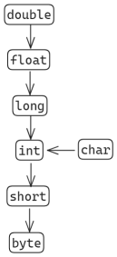

# Java self-learn notes

Book : [A Concise and Practical Introduction to Prgramming Algorithms in Java by Frank Nielsen](https://www.amazon.in/Practical-Introduction-Programming-Algorithms-Undergraduate/dp/184882338X)

# Chapter 1
### Hello World
- File name and `class` name should be same
- Workflow
    - Type/Edit program
    - Compile: `javac program.java`
    - Run/Execute: `java program`

Section 1.2.2: [HelloWorld program](./java-files/HelloWorld.java)  

### Implicit casting
Consider example:
```java
double  qq=2/3      //A
double qqq=2/3.0    //B
```
In $A$, first the operation is done with integers `2 & 3`, the output is casted into double, giving `0.0` as output. In $B$, since `3.0` is `double`, `double division` will occur and output will then be given to double variable `qqq` as `0.6666666666`

### Constants
Section 1.3 : [Mathematical functions](./java-files/MathFunction.java)  
 Constants in java are defined using `final` keyword, as they are immutable. Declared inside body of the class and not functions.

>    When we declare a variable as `final`, it means that the reference to the object it points to cannot be changed once initialized. However, it doesn't mean that the object itself (if it's mutable) cannot be modified.  
In the code file [MathFunction](./java-files/MathFunction.java), the declaration of `One` as local variable in method overshadows the one declared at `class`. Hence, `Three2` outputs `4`.

### Commenting
```java
// single line comment
/* multiline
line 
comment */
``` 

### Casting Rules
The output of `float f=22/7;` is `3.0`.  (Implicit conversion from int to float)



Also watch the videos: 
1. [Java Type Casting](https://www.youtube.com/watch?v=H0LNjF9PSeM)
2. [Upcasting and Downcasting Video](https://youtu.be/HpuH7n9VOYk?si=uC6KTmyl3AHmMPdt)

Take a look at [this code snippet](./java-files/Snippet.java), we get the output `88` which is the ASCII code for `'X'`.

### Incrementation and Decrementation
```java
x+=2 //increment x by 2 and store in x
x-=2
x*=2
x/=2
x%=2 // find x module 2 and store it in x
```

There is also post-incrementation and pre-incrementation,

The following is post-incrementation, first `i` is assigned to `j` and then `i` is incremented.
```java
i=2
j=i++ // j=2,i=3
```
For pre-incrementation:
```java
i=2
j=++i // i=3,j=3
```

### Input Output
Check file [DemoIO](./java-files/DemoIO.java) for inputting and redirecting output.
Input can be taken from a file, and output can be redirected to one by the following command:
```cmd
java DemoIO <input.txt >output.txt
```
NOTE: Powershell does not support `<` yet but `>`.